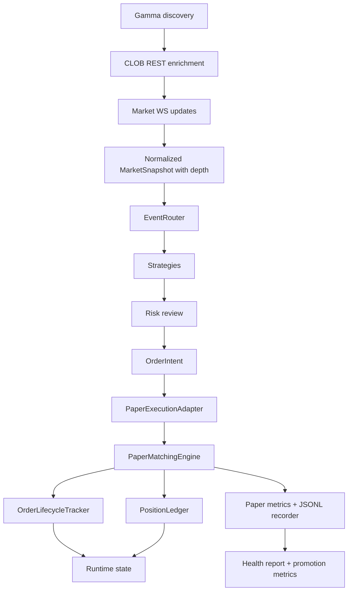
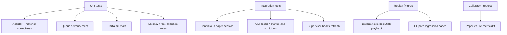

# Paper Execution Realism Plan

## 1. Purpose

This document turns the paper-realism checklist into an implementation plan.

Goal:

- make `paper` useful for promotion decisions, not just smoke testing
- reduce the gap between `paper` and `live` on execution behavior
- keep the diff engineered enough: explicit, testable, and minimal

This plan does **not** try to make paper perfectly identical to the exchange.
That is not possible with public data alone. The goal is to make paper
directionally accurate, explainable, and calibratable.

## 2. Problem Statement

Current paper trading is real-market-input but simplified execution:

- `paper` reads real Polymarket public data through Gamma and CLOB
- the current runtime uses repeated one-shot runs instead of one continuous session
- `paper` fills are top-of-book and all-or-nothing
- there is no queue position, partial fill, latency, fee, or slippage model
- signal and execution funnel metrics are not fully persisted

That creates two distortions at once:

- aggressive orders look easier than they really are
- passive maker orders look harder than they really are

The result is a paper system that is useful for strategy/risk/runtime validation,
but not yet reliable for execution-quality inference.

## 3. Success Criteria

The project is successful when paper can answer these questions with persisted,
auditable data:

- how many signals were generated
- how many signals were risk-rejected
- how many orders were submitted
- how many orders were filled, partially filled, expired, or canceled
- how long fills took
- how paper execution differs from small-live execution

The practical target is to narrow the gap between `paper` and `live` on:

- submit rate
- fill rate
- cancel rate
- average fill price vs mid-price
- average time to fill

## 4. Non-Goals

- no new alpha strategies in this project
- no UI redesign
- no map/event frontend work
- no multi-category live rollout changes
- no attempt to infer hidden exchange state perfectly

## 5. Engineering Decisions

### Decision A: replace repeated one-shot paper runs with a continuous paper session

Problem:

- the current supervisor repeatedly starts `paper-crypto-once`
- passive orders do not live inside one continuous market session

Recommendation:

- add a long-running `run-paper-crypto-session`
- keep one in-memory `PaperExecutionAdapter`, `OrderLifecycleTracker`, and `PositionLedger`
- keep the supervisor, but make it supervise a continuous session instead of creating fake session boundaries

Why:

- this is the highest-leverage fix
- without a continuous session, maker fill statistics are not trustworthy

Tradeoff:

- slightly more runtime code
- much more realistic order lifecycle behavior

### Decision B: keep one normalized snapshot model and extend it with execution-relevant book fields

Problem:

- execution only sees top-of-book prices today
- order book depth lives in adapters but not in normalized runtime state

Recommendation:

- extend `MarketSnapshot`
- do not create a second parallel `ExecutionSnapshot` abstraction yet

Why:

- minimal diff
- keeps router, strategy, risk, and execution on one shared data contract
- avoids adapter-specific execution logic leaking upward

Tradeoff:

- `MarketSnapshot` becomes richer
- but the architecture stays flatter and easier to test

### Decision C: split paper matching logic out of `PaperExecutionAdapter`

Problem:

- queue-aware matching, partial fills, and latency rules will make the adapter too large

Recommendation:

- keep `PaperExecutionAdapter` as the integration boundary
- move matching rules into a dedicated matcher module

Suggested split:

- `execution/paper_adapter.py`: lifecycle integration and external interface
- `execution/paper_matching.py`: fill rules, queue advancement, latency handling
- `execution/paper_metrics.py`: paper execution counters and summaries

Why:

- this isolates the part that will evolve fastest
- tests stay focused

Tradeoff:

- two or three files instead of one
- lower complexity per file and less future churn

### Decision D: reuse the live market-data path for paper

Problem:

- paper and live should differ in execution, not in market-data semantics

Recommendation:

- reuse Gamma bootstrap, CLOB enrichment, and market websocket updates
- paper should consume the same read-only market stream shape that live uses

Why:

- one market data path means fewer semantic mismatches
- paper/live comparison becomes cleaner

Tradeoff:

- paper runtime becomes slightly more sophisticated
- but it removes an entire class of avoidable drift

### Decision E: calibration is required; public-data simulation alone is not enough

Problem:

- no paper model can recover true exchange queue priority from public data alone

Recommendation:

- add a calibration loop against small-live observations
- treat calibration as part of the system, not a future nice-to-have

Why:

- otherwise the simulation will look precise but remain ungrounded

Tradeoff:

- extra reporting work
- much better confidence in promotion decisions

## 6. Target Architecture

### Key runtime rule

Paper and live should share:

- market discovery
- market snapshot normalization
- event router
- strategy evaluation
- risk review
- order lifecycle data model

Paper and live should differ only in:

- execution adapter
- matching model
- calibration inputs

## 7. Data Contract Changes

### 7.1 `MarketSnapshot`

Extend [types.py](/D:/dev/polymarket_bot2.0/src/pm_bot/core/types.py) with execution-relevant
fields.

Add:

- `best_bid_yes_size`
- `best_ask_yes_size`
- `best_bid_no_size`
- `best_ask_no_size`
- `tick_size`
- `min_order_size`
- `last_trade_side`
- `last_trade_size`
- `order_book_yes_levels`
- `order_book_no_levels`

Recommendation:

- move book-level shape into `core` so execution does not depend on adapter-local types
- keep all new fields optional for backward compatibility

### 7.2 Event persistence

Paper runtime must persist:

- `signal.generated`
- `signal.rejected`
- `order.submitted`
- `order.rejected`
- `order.expired`
- `order.partially_filled`
- `order.filled`
- `order.canceled`
- `trade.closed`
- `market_data.failure`
- `market_data.recovered`
- `runtime.day_rollover`

## 8. Phased Implementation Plan

### P0. Observability baseline

Objective:

- make paper explainable before making it more realistic

Code areas:

- [paper_session.py](/D:/dev/polymarket_bot2.0/src/pm_bot/runtime/paper_session.py)
- [event_router.py](/D:/dev/polymarket_bot2.0/src/pm_bot/orchestrator/event_router.py)
- [recorder.py](/D:/dev/polymarket_bot2.0/src/pm_bot/storage/recorder.py)
- [check-paper-health.ps1](/D:/dev/polymarket_bot2.0/scripts/check-paper-health.ps1)

Deliverables:

- persist paper events to `data/runtime/paper-events.current.jsonl`
- persist execution metrics to `data/runtime/paper-metrics.latest.json`
- extend health report with signal/order/fill funnel metrics

Acceptance:

- one completed paper run is enough to answer signal-to-fill funnel questions without log scraping

### P1. Continuous paper session

Objective:

- remove fake session boundaries

Code areas:

- [cli.py](/D:/dev/polymarket_bot2.0/src/pm_bot/cli.py)
- [paper_session.py](/D:/dev/polymarket_bot2.0/src/pm_bot/runtime/paper_session.py)
- [run-paper-supervisor.ps1](/D:/dev/polymarket_bot2.0/scripts/run-paper-supervisor.ps1)
- [factory.py](/D:/dev/polymarket_bot2.0/src/pm_bot/execution/factory.py)

Deliverables:

- add `run-paper-crypto-session`
- keep one execution adapter alive for the life of the session
- supervisor launches one session and monitors it

Acceptance:

- a pending maker order can survive across multiple market updates and multiple minutes

### P2. Snapshot depth expansion

Objective:

- give execution access to more than top-of-book

Code areas:

- [types.py](/D:/dev/polymarket_bot2.0/src/pm_bot/core/types.py)
- [clob_client.py](/D:/dev/polymarket_bot2.0/src/pm_bot/adapters/polymarket/clob_client.py)
- [ws_client.py](/D:/dev/polymarket_bot2.0/src/pm_bot/adapters/polymarket/ws_client.py)

Deliverables:

- persist top-level sizes
- persist first `N` levels for both sides
- carry tick/min-size constraints into normalized snapshots

Acceptance:

- execution can compute queue-ahead size and taker slippage from snapshot data alone

### P3. Queue-aware matching

Objective:

- replace top-of-book boolean fills with execution-aware fills

Code areas:

- [paper_adapter.py](/D:/dev/polymarket_bot2.0/src/pm_bot/execution/paper_adapter.py)
- [order_tracker.py](/D:/dev/polymarket_bot2.0/src/pm_bot/execution/order_tracker.py)
- new `src/pm_bot/execution/paper_matching.py`

Deliverables:

- queue-ahead tracking at submission time
- partial fills
- maker queue consumption logic
- taker multi-level sweep logic

Acceptance:

- paper can produce `partial_fill -> fill`
- fill price is no longer always exactly best bid or best ask

### P4. Latency, fees, and replace behavior

Objective:

- add the main mechanical frictions missing today

Code areas:

- [paper_adapter.py](/D:/dev/polymarket_bot2.0/src/pm_bot/execution/paper_adapter.py)
- [settings.py](/D:/dev/polymarket_bot2.0/src/pm_bot/core/settings.py)
- [base.example.toml](/D:/dev/polymarket_bot2.0/configs/base.example.toml)

Deliverables:

- configurable place latency
- configurable cancel latency
- configurable replace latency
- fee model
- slippage model for taker execution

Acceptance:

- paper PnL is no longer frictionless
- cancel behavior can differ from intent because of latency

### P5. Calibration loop

Objective:

- close the realism gap with empirical data

Code areas:

- [polymarket_live.py](/D:/dev/polymarket_bot2.0/src/pm_bot/execution/polymarket_live.py)
- [recorder.py](/D:/dev/polymarket_bot2.0/src/pm_bot/storage/recorder.py)
- new `docs/PAPER_CALIBRATION.md`

Deliverables:

- `paper` vs `live` comparison report
- calibrated parameters for queue decay, latency, and slippage

Acceptance:

- paper/live differences are measured, trended, and no longer anecdotal

### P6. Promotion-facing operator reporting

Objective:

- make promotion decisions audit-friendly

Code areas:

- [check-paper-health.ps1](/D:/dev/polymarket_bot2.0/scripts/check-paper-health.ps1)
- [KNOWN_ISSUES.md](/D:/dev/polymarket_bot2.0/docs/KNOWN_ISSUES.md)
- new `docs/PAPER_REALISM_GAP.md`

Deliverables:

- health report includes execution funnel and realism caveats
- operator report states what paper can and cannot prove

Acceptance:

- a `0 fill` day can be explained by structured counters, not guesswork

## 9. File-Level Worklist

### Existing files to modify

- [src/pm_bot/core/types.py](/D:/dev/polymarket_bot2.0/src/pm_bot/core/types.py)
- [src/pm_bot/runtime/paper_session.py](/D:/dev/polymarket_bot2.0/src/pm_bot/runtime/paper_session.py)
- [src/pm_bot/orchestrator/event_router.py](/D:/dev/polymarket_bot2.0/src/pm_bot/orchestrator/event_router.py)
- [src/pm_bot/storage/recorder.py](/D:/dev/polymarket_bot2.0/src/pm_bot/storage/recorder.py)
- [src/pm_bot/execution/paper_adapter.py](/D:/dev/polymarket_bot2.0/src/pm_bot/execution/paper_adapter.py)
- [src/pm_bot/execution/order_tracker.py](/D:/dev/polymarket_bot2.0/src/pm_bot/execution/order_tracker.py)
- [src/pm_bot/adapters/polymarket/clob_client.py](/D:/dev/polymarket_bot2.0/src/pm_bot/adapters/polymarket/clob_client.py)
- [src/pm_bot/adapters/polymarket/ws_client.py](/D:/dev/polymarket_bot2.0/src/pm_bot/adapters/polymarket/ws_client.py)
- [src/pm_bot/cli.py](/D:/dev/polymarket_bot2.0/src/pm_bot/cli.py)
- [src/pm_bot/core/settings.py](/D:/dev/polymarket_bot2.0/src/pm_bot/core/settings.py)
- [scripts/run-paper-supervisor.ps1](/D:/dev/polymarket_bot2.0/scripts/run-paper-supervisor.ps1)
- [scripts/check-paper-health.ps1](/D:/dev/polymarket_bot2.0/scripts/check-paper-health.ps1)
- [configs/base.example.toml](/D:/dev/polymarket_bot2.0/configs/base.example.toml)

### New files recommended

- `src/pm_bot/execution/paper_matching.py`
- `src/pm_bot/execution/paper_metrics.py`
- `tests/unit/execution/test_paper_matching.py`
- `tests/unit/runtime/test_paper_session_runner.py`
- `tests/integration/test_cli_paper_session.py`
- `docs/PAPER_REALISM_GAP.md`
- `docs/PAPER_CALIBRATION.md`

## 10. Test Strategy

### Required unit coverage

- queue-ahead initialization
- queue depletion over multiple book updates
- maker partial fill
- taker multi-level sweep
- order expiry
- cancel latency race
- replace latency race
- fee and net-pnl accounting
- tick size and min-order-size normalization

### Required integration coverage

- long-running continuous paper session with persistent pending orders
- market websocket update flow into paper execution
- health report refresh after each paper cycle
- recovery after transient data failure

### Required regression fixtures

- a maker order that fills across multiple updates
- a maker order that never fills and expires
- a taker order that sweeps multiple levels
- a cancel request that loses the race to a fill

## 11. Metrics and Reporting

Paper runtime must publish:

- `signals_generated`
- `signals_rejected`
- `orders_submitted`
- `orders_rejected`
- `orders_filled`
- `orders_partially_filled`
- `orders_expired`
- `orders_canceled`
- `trades_closed`
- `fill_rate`
- `cancel_rate`
- `avg_time_to_fill_ms`
- `avg_fill_price_vs_mid_bps`
- `maker_fill_share`
- `taker_fill_share`

Operator rule:

- a day with `0 fills` is not actionable until the report explains whether the root cause was:
  - no signals
  - risk rejection
  - overly passive quotes
  - queue not clearing
  - daily order limit
  - stale data

## 12. Risks and Mitigations

### Risk: over-engineering the simulation

Mitigation:

- only add abstractions that isolate fast-changing logic
- prefer extending existing runtime and execution boundaries

### Risk: paper diverges from live despite more code

Mitigation:

- calibration is a required phase, not optional polish

### Risk: performance degradation with deeper order books

Mitigation:

- cap persisted depth to a small `N`
- benchmark snapshot processing latency before and after P2/P3

### Risk: replay fixtures become unrealistic

Mitigation:

- store deterministic book-update fixtures from real PM sessions
- use them for paper regression tests

## 13. Rollout Order

Recommended order:

1. P0 observability baseline
2. P1 continuous paper session
3. P2 snapshot depth expansion
4. P3 queue-aware matching
5. P4 latency, fees, replace behavior
6. P5 calibration loop
7. P6 operator reporting

This order is opinionated on purpose:

- do not start with fees
- do not start with UI
- do not start with new strategies
- first fix session continuity and observability, because current maker-fill results are not yet interpretable

## 14. Exit Condition

This plan is complete when paper can be described as:

> a continuous-session execution simulator using real PM public market data,
> queue-aware passive matching, multi-level taker matching, explicit latency and
> fee assumptions, and empirical calibration against small-live observations.

Until then, paper remains a runtime validation tool first and an execution
estimation tool second.
