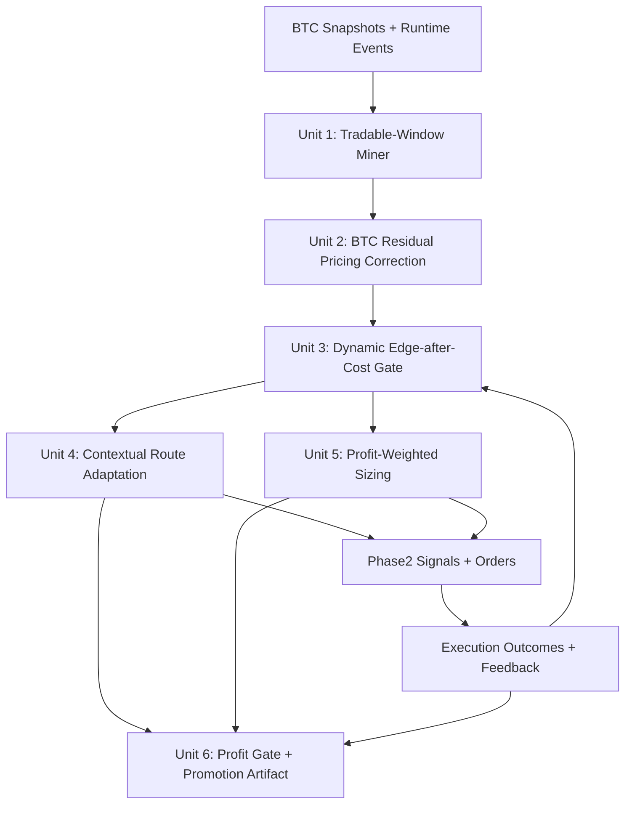
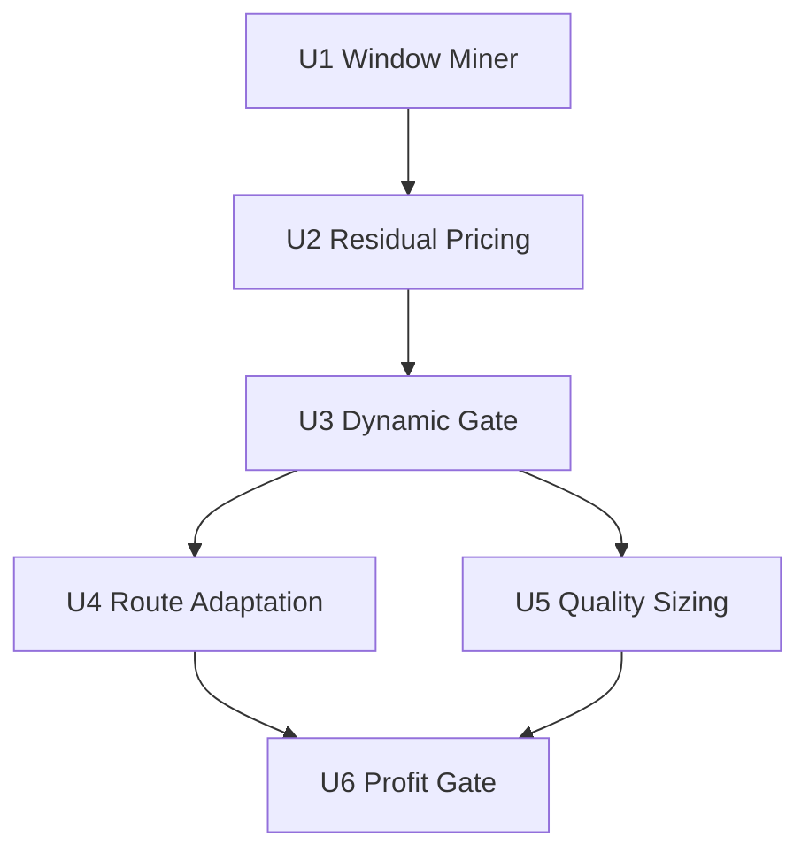
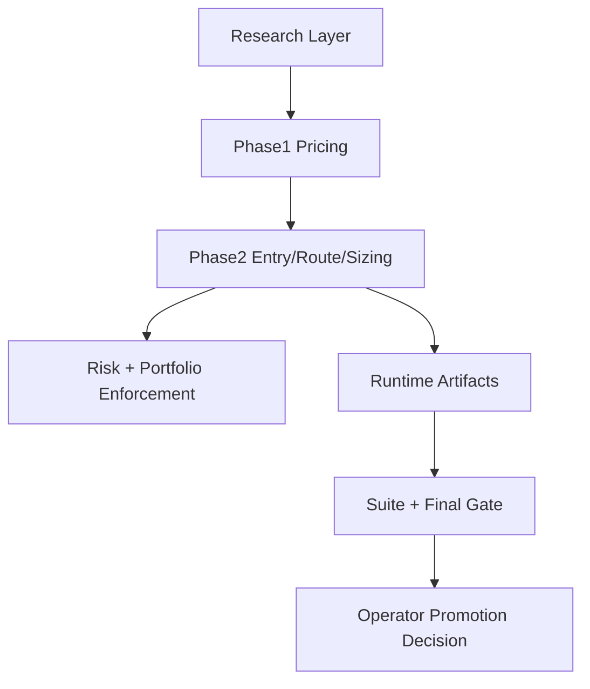

---
title: feat: BTC Profitability Inner Loop
type: feat
status: active
date: 2026-04-01
---

# feat: BTC Profitability Inner Loop

## Overview

Build a BTC-only profitability loop that improves trade quality and edge capture in the current `paper -> sync-shadow -> small-live baseline` path without relaxing safety controls. The plan prioritizes five linked upgrades: tradable-window mining, BTC residual pricing correction, dynamic edge-after-cost gating, contextual route adaptation, and profit-weighted sizing with explicit promotion gates.

## Problem Frame

Current BTC infrastructure is no longer a plumbing problem. The repo already has stable BTC profiles, selection filters, route policy, and replay/paper/suite artifacts, but profitability is still bottlenecked by:

- too many low-information windows entering tuning loops
- persistent BTC family/expiry bias in fair value vs observed behavior
- static route/eligibility thresholds that lag short-term execution regime changes
- limited conversion of execution feedback into next-run adaptive policy
- fixed notional behavior that does not reflect signal quality variance

The user goal is explicit: stay focused on BTC and strengthen this line for profitability-first progress, not cross-board expansion.

## Requirements Trace

- R1. Scope remains BTC-only for the main implementation path.
- R2. Profitability optimization is based on net outcomes (`edge after costs`, `edge capture`, `pnl per notional`), not raw signal count.
- R3. Changes are staged and small-blast-radius, with clear dependencies and rollback points.
- R4. Existing hard safety boundaries (notional caps, drawdown guardrails, halt behavior) remain enforced.
- R5. Every feature-bearing unit has explicit file targets and matching test coverage.
- R6. The system emits operator-facing go/no-go evidence for BTC stage progression.

## Scope Boundaries

- In scope: BTC-focused work in `crypto phase1/phase2`, `research`, `risk`, and promotion artifacts.
- In scope: Profiles centered on `paper-btc-short-shadow-v1` and `sync-btc-short-shadow-v1`, with `sync-btc-shadow-v1` as secondary validation.
- Out of scope: Sports/weather logic changes.
- Out of scope: Broad UI redesign or unrelated operator-console expansion.
- Out of scope: Automatic escalation to larger real-money exposure.
- Out of scope: Full multi-leg live deployment of relative-value strategies in this plan window.

## Context & Research

### Relevant Code and Patterns

- Window mining and fixed-window artifact pattern: `src/pm_bot/research/window_mining.py`, `src/pm_bot/research/experiments.py`.
- Profitability diagnostics and score formula pattern: `src/pm_bot/research/autoresearch.py`.
- BTC market selection and runtime block pattern: `src/pm_bot/strategies/crypto/phase1/selection.py`, `src/pm_bot/strategies/crypto/phase2/runtime_context.py`.
- Route and eligibility policy pattern: `src/pm_bot/strategies/crypto/phase2/execution.py`.
- In-session feedback and reentry behavior pattern: `src/pm_bot/strategies/crypto/phase2/management.py`.
- Promotion/evidence summary pattern: `src/pm_bot/strategies/crypto/phase2/suite.py`, `src/pm_bot/strategies/crypto/phase2/final_report.py`.
- Safety enforcement pattern: `src/pm_bot/risk/manager.py`, `src/pm_bot/execution/portfolio.py`.

### Institutional Learnings

- `docs/CRYPTO_MARKET_SELECTION_BTC_20260328.md` confirms some BTC strips are structurally overpriced despite acceptable liquidity.
- `docs/CRYPTO_MODULE_REMAINING_GAPS.md` identifies remaining bottlenecks: eventful windows, runtime selection depth, calibration quality, execution feedback conversion, portfolio risk aggregation.
- `docs/CRYPTO_MATURITY_PROBLEM_CHECKLIST.md` indicates market-level block improvements are done, while profit conversion gaps remain open.
- `docs/INNER_LOOP_PROFIT_LEARNING_ROADMAP_20260329.md` sets profitability/learning as primary direction and de-prioritizes outer-layer polish.

### External References

- No external research required for this plan pass; local repo patterns and domain docs are sufficient for planning-level decisions.

## Key Technical Decisions

- Decision 1: Use BTC short-horizon profile as primary profitability lane.
- Rationale: It has cleaner market filters and better fit for fast feedback loops than long-horizon thesis markets.

- Decision 2: Introduce dynamic gates before adding new strategy complexity.
- Rationale: Current weakness is quality of accepted trades, not lack of strategy branches.

- Decision 3: Keep adaptation bounded with hard floors/ceilings and sample-size guards.
- Rationale: Prevent oscillation and overreaction in noisy windows while still allowing regime adaptation.

- Decision 4: Treat pricing correction as a residual layer over existing fair-value stack.
- Rationale: Lower blast radius than replacing the pricing architecture and easier to test against current fixtures.

- Decision 5: Make sizing quality-aware but subordinate to risk caps.
- Rationale: Profit-weighted sizing should improve capital efficiency, never bypass safety governance.

- Decision 6: Promotion decisions must be artifact-driven and machine-readable.
- Rationale: Stage progression should depend on measurable BTC evidence, not narrative interpretation.

## Open Questions

### Resolved During Planning

- Which line to prioritize first: BTC only, centered on `short-shadow` execution path, with `long-shadow` as validation-only.
- What to optimize first: Trade quality and edge conversion, not raw trade count.
- Whether to relax safety constraints for faster gains: No. Hard risk boundaries remain locked during this plan.

### Deferred to Implementation

- Exact dynamic threshold coefficients per family/time bucket: Deferred because coefficients require replay/paper evidence after unit wiring.
- Minimum sample size for switching route bias state: Deferred to implementation-time calibration against fixture stability.
- Whether BTC relative-value mode should graduate beyond research: Deferred until units 1-5 produce stable profitability improvements.

## High-Level Technical Design

> *This illustrates the intended approach and is directional guidance for review, not implementation specification. The implementing agent should treat it as context, not code to reproduce.*

## Implementation Units

- [ ] **Unit 1: BTC Tradable-Window Miner And Scheduler**

**Goal:** Promote high-signal BTC windows into tuning loops and suppress low-information windows from dominating experiments.

**Requirements:** R1, R2, R3, R5

**Dependencies:** None

**Files:**
- Modify: `src/pm_bot/research/window_mining.py`
- Modify: `src/pm_bot/research/experiments.py`
- Modify: `src/pm_bot/research/autoresearch.py`
- Modify: `src/pm_bot/cli.py`
- Test: `tests/unit/research/test_window_mining.py`
- Test: `tests/unit/research/test_experiments.py`
- Test: `tests/unit/research/test_autoresearch.py`
- Test: `tests/integration/test_cli_research.py`

**Approach:**
- Extend window scoring with profitability-relevant components such as edge-after-cost proxy, fill-bearing density, and rejection-quality penalties.
- Add BTC family and expiry bucket labels into mined window artifacts for downstream conditioning.
- Provide CLI entrypoints that output deterministic top-window sets for phase2 suite/replay consumption.

**Execution note:** Start with failing unit tests for deterministic window ranking and artifact schema before changing scoring weights.

**Patterns to follow:**
- `WindowMiningReport` and artifact writer style in `src/pm_bot/research/window_mining.py`
- report/format patterns in `src/pm_bot/research/autoresearch.py`

**Test scenarios:**
- Happy path: Mixed BTC events produce ranked windows and non-empty `fill-bearing` labels in output artifacts.
- Edge case: Capture with sparse events returns fewer windows without crash and with explicit zero-window summary.
- Error path: Invalid event payload timestamps are skipped without corrupting ranking.
- Integration: CLI command writes summary and window files with stable ordering across repeated runs on identical fixtures.

**Verification:**
- Window-mining outputs include profitability-oriented ranking fields and remain deterministic on fixed fixtures.
- Phase2 experiment entrypoint can consume mined BTC windows without manual artifact reshaping.

- [ ] **Unit 2: BTC Family/Expiry Residual Pricing Correction**

**Goal:** Reduce systematic BTC pricing miss by introducing a bounded residual correction layer over current fair-value fusion.

**Requirements:** R1, R2, R3, R5

**Dependencies:** Unit 1

**Files:**
- Modify: `src/pm_bot/strategies/crypto/phase1/calibration.py`
- Modify: `src/pm_bot/strategies/crypto/phase1/pricing.py`
- Modify: `src/pm_bot/strategies/crypto/phase1/fusion.py`
- Modify: `src/pm_bot/strategies/crypto/phase1/models.py`
- Modify: `src/pm_bot/strategies/crypto/phase1/baseline.py`
- Test: `tests/unit/strategies/test_crypto_phase1_calibration.py`
- Test: `tests/unit/strategies/test_crypto_phase1_pricing.py`
- Test: `tests/unit/strategies/test_crypto_phase1_fusion.py`
- Test: `tests/unit/strategies/test_crypto_phase1_replay.py`

**Approach:**
- Define residual buckets keyed by at least `underlying`, `event_family`, and expiry bucket.
- Apply correction post-fusion with strict clipping and confidence gating to avoid over-adjustment.
- Persist correction diagnostics in fair-value supporting fields for downstream attribution.

**Execution note:** Implement test-first on BTC validation fixtures to prove fallback behavior before enabling corrections by default.

**Patterns to follow:**
- baseline lock and model config patterns in `src/pm_bot/strategies/crypto/phase1/baseline.py`
- supporting-values enrichment patterns in `src/pm_bot/strategies/crypto/phase1/edge.py`

**Test scenarios:**
- Happy path: Known BTC family bucket receives correction and moves fair probability in expected direction.
- Edge case: Unknown bucket falls back to original fused fair value without changing current behavior.
- Error path: Corrupted correction payload is ignored with safe defaults and explicit diagnostic tag.
- Integration: Replay output exposes correction diagnostics and remains compatible with existing signal generation.

**Verification:**
- BTC validation artifacts show reduced persistent miss in targeted families without breaking non-BTC paths.
- Existing phase1 replay tests stay green with deterministic output shape.

- [ ] **Unit 3: Dynamic Edge-After-Cost Eligibility Gate**

**Goal:** Replace static eligibility thresholds with bounded dynamic thresholds that reflect recent BTC execution friction.

**Requirements:** R1, R2, R3, R4, R5

**Dependencies:** Unit 2

**Files:**
- Modify: `src/pm_bot/strategies/crypto/phase2/runtime_context.py`
- Modify: `src/pm_bot/strategies/crypto/phase2/execution.py`
- Modify: `src/pm_bot/strategies/crypto/phase2/strategy.py`
- Modify: `src/pm_bot/strategies/crypto/phase2/models.py`
- Modify: `configs/profiles/paper-btc-short-shadow-v1/crypto.v1.example.toml`
- Modify: `configs/profiles/sync-btc-short-shadow-v1/crypto.v1.example.toml`
- Test: `tests/unit/strategies/test_crypto_phase2_runtime_context.py`
- Test: `tests/unit/strategies/test_crypto_phase2_execution.py`
- Test: `tests/unit/strategies/test_crypto_phase2_strategy.py`

**Approach:**
- Compute rolling per-family cost regime metrics from recent fills/expiries/rejections.
- Derive dynamic `min_net_edge` and taker premium guardrails with explicit floor/ceiling bounds from config.
- Emit structured skip reasons so operators can distinguish "no alpha" from "cost regime too expensive".

**Patterns to follow:**
- execution eligibility and route decision interfaces in `src/pm_bot/strategies/crypto/phase2/execution.py`
- runtime context event summarization in `src/pm_bot/strategies/crypto/phase2/runtime_context.py`

**Test scenarios:**
- Happy path: Favorable cost regime lowers dynamic threshold within allowed floor and allows qualifying signals.
- Edge case: Insufficient recent samples keeps baseline thresholds unchanged.
- Error path: Missing runtime context metrics does not raise and defaults to static gates.
- Integration: Strategy emits dynamic gate reason tags that match runtime context values.

**Verification:**
- Eligibility decisions become regime-aware while respecting configured hard floors and risk caps.
- Artifact diagnostics can explain why a signal was skipped during high-friction windows.

- [ ] **Unit 4: Contextual Route Adaptation For Maker/Taker/Skip**

**Goal:** Convert execution feedback into bounded route-policy adaptation at BTC family/signal-type granularity.

**Requirements:** R1, R2, R3, R4, R5

**Dependencies:** Unit 3

**Files:**
- Modify: `src/pm_bot/strategies/crypto/phase2/management.py`
- Modify: `src/pm_bot/strategies/crypto/phase2/runtime_context.py`
- Modify: `src/pm_bot/strategies/crypto/phase2/execution.py`
- Modify: `src/pm_bot/strategies/crypto/phase2/config_registry.py`
- Test: `tests/unit/strategies/test_crypto_phase2_management.py`
- Test: `tests/unit/strategies/test_crypto_phase2_runtime_context.py`
- Test: `tests/unit/strategies/test_crypto_phase2_execution.py`

**Approach:**
- Maintain route-policy state keyed by `underlying + event_family + signal_type`.
- Update bias only after minimum sample counts and cooldown windows to prevent policy thrash.
- Restrict adaptation amplitude to configured bounds so risk posture remains predictable.

**Patterns to follow:**
- current feedback summarization and route bias pattern in `src/pm_bot/strategies/crypto/phase2/management.py`
- preset override conventions in `src/pm_bot/strategies/crypto/phase2/config_registry.py`

**Test scenarios:**
- Happy path: Repeated maker expiries in one family increase aggressiveness or shift to taker for qualifying signals.
- Edge case: Mixed outcomes keep policy in stable mode and avoid oscillating route decisions.
- Error path: Incomplete event payloads do not poison policy state and keep previous valid state.
- Integration: Route decisions include adaptation rationale tags and remain deterministic on fixed replay fixtures.

**Verification:**
- Route adaptation responds to persistent patterns, not single-event noise.
- Policy transitions are observable in artifacts and reversible when regime improves.

- [ ] **Unit 5: Profit-Weighted Sizing With BTC Exposure Budgeting**

**Goal:** Improve capital efficiency by weighting notional by quality while preserving all hard risk caps.

**Requirements:** R1, R2, R3, R4, R5

**Dependencies:** Unit 3

**Files:**
- Modify: `src/pm_bot/strategies/crypto/phase2/strategy.py`
- Modify: `src/pm_bot/strategies/crypto/phase2/config_registry.py`
- Modify: `src/pm_bot/execution/portfolio.py`
- Modify: `src/pm_bot/risk/manager.py`
- Modify: `src/pm_bot/core/settings.py`
- Test: `tests/unit/strategies/test_crypto_phase2_strategy.py`
- Test: `tests/unit/execution/test_portfolio.py`
- Test: `tests/unit/risk/test_manager.py`

**Approach:**
- Compute a bounded quality score from confidence, dynamic edge-after-cost, and route feedback quality.
- Map score to notional multipliers with explicit min/max bounds and conservative default.
- Enforce underlying/thesis-group caps before order approval so dynamic sizing cannot bypass risk manager constraints.

**Patterns to follow:**
- cap-utilization and exposure-group handling in `src/pm_bot/execution/portfolio.py`
- projected notional checks in `src/pm_bot/risk/manager.py`

**Test scenarios:**
- Happy path: High-quality BTC signals receive larger notional within configured multiplier limits.
- Edge case: Low-quality regime shrinks notional toward floor without dropping to zero when trade remains eligible.
- Error path: Missing quality components falls back to base notional and preserves previous behavior.
- Integration: Risk manager rejects orders that exceed caps even after multiplier expansion.

**Verification:**
- Sizing varies with quality as designed and remains subordinate to risk boundaries.
- Portfolio/risk metrics show no hidden concentration drift after multiplier rollout.

- [ ] **Unit 6: BTC Profit Gate And Promotion Decision Artifact**

**Goal:** Produce a machine-readable BTC promotion decision based on profitability and stability evidence.

**Requirements:** R2, R3, R4, R5, R6

**Dependencies:** Unit 4, Unit 5

**Files:**
- Modify: `src/pm_bot/strategies/crypto/phase2/suite.py`
- Modify: `src/pm_bot/strategies/crypto/phase2/final_report.py`
- Modify: `src/pm_bot/research/autoresearch.py`
- Modify: `src/pm_bot/cli.py`
- Modify: `docs/CRYPTO_MATURITY_PROBLEM_CHECKLIST.md`
- Test: `tests/unit/strategies/test_crypto_phase2_suite.py`
- Test: `tests/unit/research/test_autoresearch.py`
- Create: `tests/unit/strategies/test_crypto_phase2_final_report.py`
- Test: `tests/integration/test_cli_research.py`

**Approach:**
- Define explicit BTC gate metrics such as minimum closed-trade count, edge-capture floor, max execution-loss ratio, and risk-status constraints.
- Emit standardized decision states (`proceed`, `review`, `pause`) with blocking reasons and stage label guidance.
- Keep report fields backward-compatible or versioned when adding operator-facing contract fields.

**Patterns to follow:**
- scorecard composition pattern in `src/pm_bot/strategies/crypto/phase2/final_report.py`
- report formatting and CLI output style in `src/pm_bot/research/autoresearch.py`

**Test scenarios:**
- Happy path: Metrics meeting gate thresholds yield `proceed` with consistent recommendation fields.
- Edge case: Thin evidence (low trade count) yields `review` with explicit insufficiency reason.
- Error path: Halted runtime or risk breach yields `pause` regardless of isolated profitability wins.
- Integration: CLI command prints and persists consistent gate decision payloads consumable by ops workflows.

**Verification:**
- Promotion decision is reproducible from artifacts and no longer depends on manual interpretation.
- Checklist and scorecard outputs remain aligned on stage readiness semantics.

## System-Wide Impact

- **Interaction graph:** Research windows and pricing diagnostics feed phase2 runtime context, which feeds route/sizing decisions, then risk manager approval, then scorecard/gate artifacts.
- **Error propagation:** Corrupted or sparse diagnostics must degrade gracefully to static defaults, not block trading loop execution.
- **State lifecycle risks:** New adaptive state must avoid stale carry-over across unrelated sessions and keep deterministic replay behavior.
- **API surface parity:** CLI/report contract changes affect operator automation and tests; output schema must be stable or explicitly versioned.
- **Integration coverage:** Cross-layer tests are required for `runtime_context -> strategy -> risk -> final_report` behavior.
- **Unchanged invariants:** Existing hard caps, halt semantics, and non-BTC board behavior remain unchanged.

## Risks & Dependencies

| Risk | Mitigation |
|------|------------|
| Overfitting on mined BTC windows | Keep holdout fixtures and require out-of-sample checks before threshold promotion |
| Adaptive gate oscillation | Add sample-size guards, cooldown windows, and bounded adjustment ranges |
| Dynamic sizing increases concentration | Keep risk-manager caps authoritative and add exposure regression tests |
| Report contract drift breaks ops tooling | Add contract tests and explicit schema compatibility checks |
| Hidden regression in non-BTC crypto paths | Keep BTC-specific feature flags/profile scoping and run targeted phase2 regression suite |
| Premature stage escalation from small sample wins | Gate progression on minimum evidence volume plus stability metrics |

## Documentation / Operational Notes

- Update BTC profile usage notes in `README.md` after units land, including which profile is primary for profitability tuning.
- Update BTC maturity and checklist docs when gates and semantics change:
- `docs/CRYPTO_MATURITY_PROBLEM_CHECKLIST.md`
- `docs/CRYPTO_MODULE_REMAINING_GAPS.md`
- Keep stage labels explicit (`paper available`, `shadow validation`, `small-range real-environment validation`) and avoid over-claiming.

## Sources & References

- Ideation source: [docs/ideation/2026-04-01-btc-profit-line-ideation.md](/D:/dev/polymarket_bot2.0/docs/ideation/2026-04-01-btc-profit-line-ideation.md)
- Related roadmap: [docs/INNER_LOOP_PROFIT_LEARNING_ROADMAP_20260329.md](/D:/dev/polymarket_bot2.0/docs/INNER_LOOP_PROFIT_LEARNING_ROADMAP_20260329.md)
- Related gap analysis: [docs/CRYPTO_MODULE_REMAINING_GAPS.md](/D:/dev/polymarket_bot2.0/docs/CRYPTO_MODULE_REMAINING_GAPS.md)
- Related checklist: [docs/CRYPTO_MATURITY_PROBLEM_CHECKLIST.md](/D:/dev/polymarket_bot2.0/docs/CRYPTO_MATURITY_PROBLEM_CHECKLIST.md)
- Key code surface: `src/pm_bot/research/window_mining.py`
- Key code surface: `src/pm_bot/research/autoresearch.py`
- Key code surface: `src/pm_bot/strategies/crypto/phase1/selection.py`
- Key code surface: `src/pm_bot/strategies/crypto/phase2/runtime_context.py`
- Key code surface: `src/pm_bot/strategies/crypto/phase2/execution.py`
- Key code surface: `src/pm_bot/strategies/crypto/phase2/strategy.py`
- Key code surface: `src/pm_bot/strategies/crypto/phase2/final_report.py`

