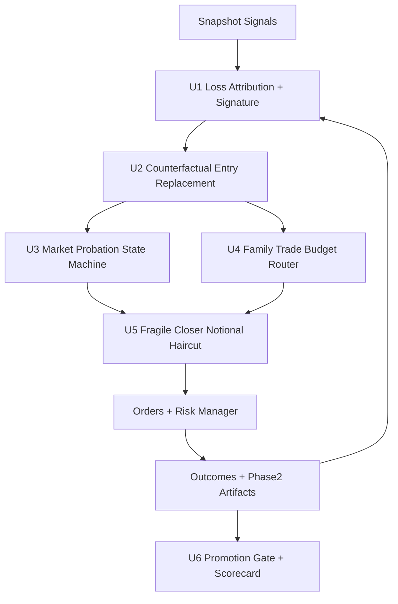
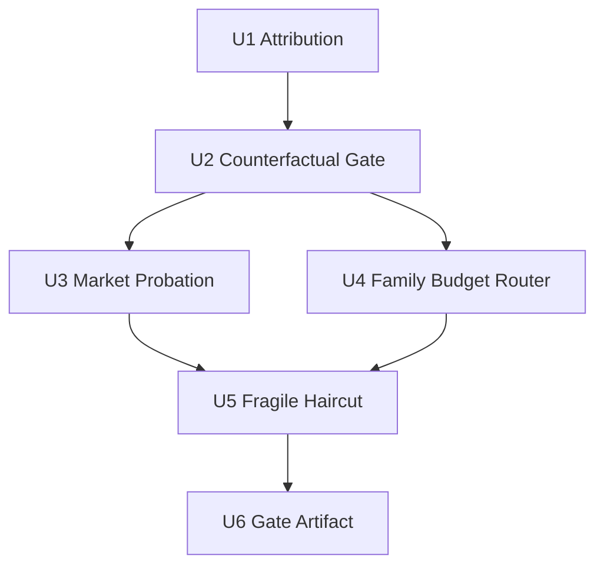

# feat: BTC Loss-Replacement Profitability Loop

## Overview

This plan focuses only on the current BTC profitability bottleneck: repeated high-loss entries that keep `small_bucket_pnl_per_notional` stuck even when `closed` count is acceptable.

Primary objective for this planning window:

- keep `closed >= 3` as a hard evaluation floor
- reduce concentration of top-loss trades
- improve profitability from the current replay plateau without relaxing hard risk controls

## Problem Frame

The current BTC line already has:

- stable BTC profile paths
- route and time-stop guard rails
- replay/paper artifacts and phase2 suite wiring

But replay evidence still shows:

- a small number of outlier entries dominate losses
- broad threshold sweeps are near plateau
- lowering losses often collapses closure count to `closed=1~2`

The highest leverage path is no longer "global threshold tuning", but "entry replacement + localized suppression + bounded sizing impact reduction" for fragile markets/signatures.

## Requirements Trace

- R1. Scope stays BTC-only for this plan.
- R2. The plan must prioritize net profitability metrics (`small_bucket_pnl_per_notional`, edge-after-cost, tail-loss concentration), not signal count alone.
- R3. `closed >= 3` is required for candidate comparison in this phase.
- R4. Existing hard risk boundaries remain authoritative and cannot be bypassed.
- R5. Every feature-bearing unit lists exact code and test file paths.
- R6. New behaviors must emit operator-facing diagnostics explaining why trades are replaced, blocked, or size-haircut.
- R7. Promotion language remains stage-accurate (`replay/paper/shadow`), no over-claiming live readiness.

## Scope Boundaries

- In scope: BTC phase2 decision path improvements targeting high-loss replacement.
- In scope: replay-first validation, then paper/shadow confirmation on existing BTC profiles.
- In scope: incremental diagnostics to support go/no-go decisions.
- Out of scope: sports/weather lines.
- Out of scope: broad multi-underlying expansion (ETH and others).
- Out of scope: full strategy architecture rewrite.
- Out of scope: automatic increase in real-money exposure.

## Context & Research

### Current Baseline (from recent BTC runs)

- Best known `closed=3` plateau is around `small_bucket_pnl_per_notional = -0.004236`.
- Attempts that further reduce loss often drop to `closed=2`, failing stability floor.
- Largest loss trades are concentrated in a few repeated market/signature contexts.

### Relevant Local Patterns

- Entry and route decision surface:
  - `src/pm_bot/strategies/crypto/phase2/strategy.py`
  - `src/pm_bot/strategies/crypto/phase2/execution.py`
- Feedback and adaptive state surface:
  - `src/pm_bot/strategies/crypto/phase2/management.py`
  - `src/pm_bot/strategies/crypto/phase2/runtime_context.py`
- Profile/preset wiring:
  - `src/pm_bot/strategies/crypto/phase2/config_registry.py`
- Operator evidence surface:
  - `src/pm_bot/strategies/crypto/phase2/final_report.py`
  - `src/pm_bot/strategies/crypto/phase2/suite.py`
  - `src/pm_bot/research/autoresearch.py`
- Risk/exposure authority:
  - `src/pm_bot/risk/manager.py`
  - `src/pm_bot/execution/portfolio.py`

### Institutional References

- `docs/ideation/2026-04-01-btc-profit-line-ideation.md`
- `docs/INNER_LOOP_PROFIT_LEARNING_ROADMAP_20260329.md`
- `docs/CRYPTO_MODULE_REMAINING_GAPS.md`
- `docs/CRYPTO_MATURITY_PROBLEM_CHECKLIST.md`

No external research is required for this pass; repo and existing BTC artifacts are sufficient.

## Key Technical Decisions

- Decision 1: Shift from global threshold sweeps to targeted high-loss replacement.
  - Rationale: The observed loss profile is concentrated, so local replacement has better leverage than system-wide retuning.

- Decision 2: Introduce counterfactual entry gating before order placement.
  - Rationale: Replacing a bad entry with a better same-snapshot alternative is higher impact than optimizing exits after bad entry.

- Decision 3: Add market probation with graduated reinstatement, not permanent blacklist.
  - Rationale: Avoid repeated tail losses while preserving adaptability if regime recovers.

- Decision 4: Add family-level trade budget routing as a bounded layer, not a full policy learner.
  - Rationale: Lower implementation risk and easier reasoning than jumping to unconstrained contextual bandits.

- Decision 5: Use fragile-closer notional haircut as a risk-shaped buffer, never as a cap bypass.
  - Rationale: Reduce tail impact when entry suppression is incomplete while keeping risk manager authority intact.

- Decision 6: Promote only with machine-readable evidence that includes closure floor and tail-loss constraints.
  - Rationale: Prevent narrative-driven promotion when profits come from unstable or low-sample behavior.

## Open Questions

### Resolved During Planning

- Priority direction: loss-replacement loop first, not further broad sweeps.
- Evaluation floor: keep `closed >= 3`.
- Safety posture: maintain current hard risk constraints unchanged.

### Deferred to Implementation

- Exact score weights for counterfactual ranking by family and signal type.
- Exact probation downgrade/recovery thresholds per market.
- Exact fragile-closer haircut curve (piecewise vs linear), to be set by replay evidence.
- Whether signature suppression should be enabled by default or profile-flag gated at first rollout.

## High-Level Technical Design

> Directional design only; not implementation code.

## Implementation Units

- [ ] **Unit 1: Loss Attribution and Signature Diagnostics**

**Goal:** Build deterministic diagnostics that explain which market/signature clusters drive tail losses.

**Requirements:** R1, R2, R5, R6

**Dependencies:** None

**Files:**
- Modify: `src/pm_bot/strategies/crypto/phase2/final_report.py`
- Modify: `src/pm_bot/strategies/crypto/phase2/suite.py`
- Modify: `src/pm_bot/research/autoresearch.py`
- Test: `tests/unit/strategies/test_crypto_phase2_final_report.py`
- Test: `tests/unit/strategies/test_crypto_phase2_suite.py`
- Test: `tests/unit/research/test_autoresearch.py`

**Approach:**
- Add top-loss decomposition fields (market, family, signal-type, signature bucket).
- Add deterministic ranking of top-N adverse trades for run-to-run comparability.
- Emit artifact fields used by downstream gating units, without changing legacy fields unexpectedly.

**Test scenarios:**
- Happy path: mixed outcomes produce stable top-loss ranking and signature breakdown.
- Edge case: fewer than N closed trades still yields valid, non-crashing summary.
- Error path: missing optional attributes degrade to `unknown` buckets with explicit counters.

**Verification:**
- Operators can identify repeated high-loss signatures from one artifact file without manual log digging.

- [ ] **Unit 2: Counterfactual Entry Replacement Gate**

**Goal:** Before opening a trade, rank contemporaneous alternatives and block non-top candidates when downside-adjusted score is weak.

**Requirements:** R1, R2, R3, R5, R6

**Dependencies:** Unit 1

**Files:**
- Modify: `src/pm_bot/strategies/crypto/phase2/strategy.py`
- Modify: `src/pm_bot/strategies/crypto/phase2/execution.py`
- Modify: `src/pm_bot/strategies/crypto/phase2/models.py`
- Modify: `src/pm_bot/strategies/crypto/phase2/config_registry.py`
- Test: `tests/unit/strategies/test_crypto_phase2_strategy.py`
- Test: `tests/unit/strategies/test_crypto_phase2_execution.py`

**Approach:**
- Build a per-snapshot candidate set and compute downside-adjusted score using existing edge/cost/quality fields.
- Allow configurable `top_k` and minimum replacement margin.
- Emit explicit skip reasons (`counterfactual_replaced`, `counterfactual_margin_too_low`).

**Test scenarios:**
- Happy path: weak candidate is replaced by stronger same-snapshot alternative.
- Edge case: only one eligible candidate keeps previous behavior.
- Error path: incomplete candidate metrics fall back to baseline selection logic safely.

**Verification:**
- Replay shows reduced contribution of known top-loss signatures while preserving `closed >= 3`.

- [ ] **Unit 3: Market Probation with Graduated Reinstatement**

**Goal:** Suppress repeated offender markets through reversible probation states (`active -> probation -> quarantined -> recovery`).

**Requirements:** R1, R2, R3, R4, R5, R6

**Dependencies:** Unit 2

**Files:**
- Modify: `src/pm_bot/strategies/crypto/phase2/management.py`
- Modify: `src/pm_bot/strategies/crypto/phase2/runtime_context.py`
- Modify: `src/pm_bot/strategies/crypto/phase2/config_registry.py`
- Modify: `src/pm_bot/strategies/crypto/phase2/strategy.py`
- Test: `tests/unit/strategies/test_crypto_phase2_management.py`
- Test: `tests/unit/strategies/test_crypto_phase2_runtime_context.py`
- Test: `tests/unit/strategies/test_crypto_phase2_strategy.py`

**Approach:**
- Track per-market rolling adverse metrics and probation state.
- Define minimum evidence size, cooldown, and re-enable criteria.
- Keep state deterministic and bounded so replay reproducibility is preserved.

**Test scenarios:**
- Happy path: repeated adverse outcomes move market into probation/quarantine.
- Edge case: mixed outcomes keep market in active or recovery without thrashing.
- Error path: stale or missing state store does not crash strategy and falls back safely.

**Verification:**
- Known repeat-offender markets are suppressed until recovery evidence appears.

- [ ] **Unit 4: Family-Aware Trade Budget Router**

**Goal:** Allocate per-run BTC family trade budget so quality-deteriorated families do not consume most entries.

**Requirements:** R1, R2, R3, R5, R6

**Dependencies:** Unit 2

**Files:**
- Modify: `src/pm_bot/strategies/crypto/phase2/runtime_context.py`
- Modify: `src/pm_bot/strategies/crypto/phase2/execution.py`
- Modify: `src/pm_bot/strategies/crypto/phase2/strategy.py`
- Modify: `src/pm_bot/strategies/crypto/phase2/config_registry.py`
- Test: `tests/unit/strategies/test_crypto_phase2_runtime_context.py`
- Test: `tests/unit/strategies/test_crypto_phase2_execution.py`
- Test: `tests/unit/strategies/test_crypto_phase2_strategy.py`

**Approach:**
- Maintain per-family quality score and map to bounded budget shares.
- Route entry opportunities respecting both eligibility and remaining family budget.
- Keep conservative fallback to neutral budget split when evidence is insufficient.

**Test scenarios:**
- Happy path: stronger family receives more accepted entries within caps.
- Edge case: low sample size uses neutral budget and avoids premature biasing.
- Error path: unknown family labels map to neutral bucket without drop.

**Verification:**
- Entry distribution shifts away from low-quality families without collapsing total closures.

- [ ] **Unit 5: Fragile-Closer Notional Haircut**

**Goal:** Reduce blast radius for markets with poor close efficiency while preserving hard risk caps and baseline behavior fallback.

**Requirements:** R1, R2, R3, R4, R5, R6

**Dependencies:** Unit 3, Unit 4

**Files:**
- Modify: `src/pm_bot/strategies/crypto/phase2/strategy.py`
- Modify: `src/pm_bot/strategies/crypto/phase2/config_registry.py`
- Modify: `src/pm_bot/risk/manager.py`
- Modify: `src/pm_bot/execution/portfolio.py`
- Test: `tests/unit/strategies/test_crypto_phase2_strategy.py`
- Test: `tests/unit/risk/test_manager.py`
- Test: `tests/unit/execution/test_portfolio.py`

**Approach:**
- Define close-efficiency score from time-stop share and passive-expiry behavior.
- Apply bounded haircut multiplier before risk manager checks.
- Ensure risk caps remain final authority regardless of multiplier.

**Test scenarios:**
- Happy path: fragile closers get reduced notional, stable closers keep baseline size.
- Edge case: missing close-efficiency stats defaults to multiplier `1.0`.
- Error path: multiplier config out of range is clipped and logged.

**Verification:**
- Tail-loss per trade decreases for fragile clusters without disabling eligible trades globally.

- [ ] **Unit 6: Profit Gate and Promotion Artifact (Loss-Concentration Aware)**

**Goal:** Produce stage-accurate go/no-go output using closure floor plus tail-risk constraints.

**Requirements:** R2, R3, R4, R5, R6, R7

**Dependencies:** Unit 5

**Files:**
- Modify: `src/pm_bot/strategies/crypto/phase2/final_report.py`
- Modify: `src/pm_bot/strategies/crypto/phase2/suite.py`
- Modify: `src/pm_bot/research/autoresearch.py`
- Modify: `src/pm_bot/cli.py`
- Modify: `docs/CRYPTO_MATURITY_PROBLEM_CHECKLIST.md`
- Test: `tests/unit/strategies/test_crypto_phase2_final_report.py`
- Test: `tests/unit/strategies/test_crypto_phase2_suite.py`
- Test: `tests/unit/research/test_autoresearch.py`
- Test: `tests/integration/test_cli_research.py`

**Approach:**
- Add gate fields for:
  - minimum closure count
  - max single-loss bound
  - top-3 loss concentration ratio
  - profitability floor
- Emit machine-readable states: `proceed`, `review`, `pause` with explicit blockers.
- Keep output schema backward-compatible or explicitly versioned.

**Test scenarios:**
- Happy path: all thresholds met returns `proceed`.
- Edge case: profitability improves but closure floor fails returns `review`.
- Error path: risk breach or halt status returns `pause` regardless of pnl.

**Verification:**
- Promotion decision no longer depends on manual interpretation of raw tables.

## System-Wide Impact

- Entry pipeline now includes replacement and budget routing layers before order placement.
- Runtime state expands with market probation and signature diagnostics, so state lifecycle/reset rules must stay explicit.
- Reporting contracts gain loss-concentration fields, affecting operator scripts and regression fixtures.
- Risk manager remains unchanged as authority boundary; new logic must feed into it, not bypass it.
- Non-BTC behaviors must remain default-equivalent unless explicitly enabled by BTC profiles.

## Risks & Dependencies

| Risk | Mitigation |
|------|------------|
| Overfitting replacement gate to current snapshot set | Keep holdout replay windows and require out-of-sample checks before profile default-on |
| Closure count collapse after stricter replacement | Enforce `closed>=3` floor in evaluation and tune with bounded margins |
| Probation state thrashing across noisy runs | Use minimum sample, cooldown, and gradual recovery state |
| Budget router suppresses sudden valid opportunities | Keep neutral fallback and per-run caps, not hard exclusion |
| Haircut logic hides deeper entry-quality issue | Treat haircut as secondary shield; keep attribution dashboard to expose root problem |
| Report schema drift breaks tools | Add contract tests and versioned fields when needed |

## Validation and Exit Criteria

A candidate iteration is considered successful only when all conditions below hold on agreed replay windows:

- `closed >= 3`
- `small_bucket_pnl_per_notional` improves versus current baseline plateau
- max single-loss trade magnitude decreases versus baseline
- top-3 loss concentration ratio decreases
- no hard-risk invariant regressions

Paper/shadow progression conditions:

- replay success is repeatable on holdout windows
- new diagnostic fields remain stable and parsable
- stage label remains `paper/shadow validation`, not live-ready claim

## Documentation / Operational Notes

- Keep BTC profile documentation aligned when new flags land:
  - `configs/profiles/paper-btc-short-shadow-v1/crypto.v1.example.toml`
  - `configs/profiles/sync-btc-short-shadow-v1/crypto.v1.example.toml`
- Update maturity checklist wording when promotion gates change:
  - `docs/CRYPTO_MATURITY_PROBLEM_CHECKLIST.md`
- Ensure operator-facing docs explain:
  - what triggers replacement/probation/haircut
  - how to read new blocker fields in final report

## Sources & References

- Ideation origin: `docs/ideation/2026-04-01-btc-profit-line-ideation.md`
- Existing broad plan: `docs/plans/2026-04-01-001-feat-btc-profitability-inner-loop-plan.md`
- Profit loop roadmap: `docs/INNER_LOOP_PROFIT_LEARNING_ROADMAP_20260329.md`
- Gap checklist: `docs/CRYPTO_MODULE_REMAINING_GAPS.md`
- Maturity checklist: `docs/CRYPTO_MATURITY_PROBLEM_CHECKLIST.md`
