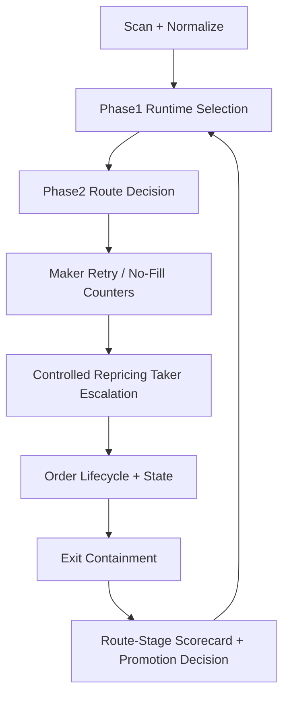

# feat: BTC Route-to-Acceptance Closure Plan

## Overview

This plan targets one outcome: make the BTC pipeline pass route-level and system-level acceptance gates in replay/paper evidence, without weakening hard risk controls.

The work stays on BTC only and focuses on the full route:

- market scan
- fair-value identification
- runtime selection
- route decision (maker/taker)
- order lifecycle
- close-out quality
- promotion gate evidence

## Problem Frame

Current evidence shows a structural mismatch across route stages:

- selection is too often blocked by `execution_no_fill + wide_spread`
- filtered path still tends toward `maker-only` submissions and high expiration
- aggressive taker unlock can increase closed trades but causes loss concentration and single-loss breaches

So the target is not "more trades" alone. The target is "controlled fill conversion with bounded downside".

## Requirements Trace

- R1. Scope is BTC line only.
- R2. Keep hard risk boundaries authoritative; no bypass of risk manager.
- R3. Route acceptance requires non-zero filtered closed trades and non-fragile fill behavior.
- R4. Profit acceptance requires non-negative (or clearly improving toward non-negative) pnl-per-notional with bounded tail loss.
- R5. Every feature-bearing unit must list exact code and test file paths.
- R6. Operator artifacts must explain blockers at each stage in plain fields.
- R7. Stage language must stay accurate (`replay/backtest` or `paper`), no live-ready overstatement.

## Scope Boundaries

In scope:

- BTC runtime selection and route-decision alignment
- controlled repricing taker escalation
- no-fill quarantine behavior tuning under guardrails
- close-out loss containment for taker-driven exits
- acceptance scorecard and blockers aligned to route stages

Out of scope:

- sports/weather lines
- multi-underlying expansion beyond BTC
- full strategy rewrite or framework migration
- any real-money permission widening

## Context & Research

Relevant implementation surfaces:

- Phase1 selection and runtime tradability policy:
  - `src/pm_bot/strategies/crypto/phase1/selection.py`
  - `tests/unit/strategies/test_crypto_phase1_selection.py`
- Phase2 route decision and order lifecycle:
  - `src/pm_bot/strategies/crypto/phase2/execution.py`
  - `src/pm_bot/strategies/crypto/phase2/strategy.py`
  - `src/pm_bot/strategies/crypto/phase2/runtime_context.py`
  - `src/pm_bot/strategies/crypto/phase2/management.py`
- Phase2 gating and evidence outputs:
  - `src/pm_bot/strategies/crypto/phase2/suite.py`
  - `src/pm_bot/strategies/crypto/phase2/final_report.py`
  - `src/pm_bot/research/autoresearch.py`

Current run evidence (latest loop) indicates:

- reducing early no-fill blocking increases filtered submissions
- but submissions remain heavily maker-dominant in problematic windows
- force-taker diagnostics prove route can switch, but loss distribution becomes unacceptable

No external research is required for this pass; repo patterns and existing artifacts are sufficient.

## Key Technical Decisions

- Decision 1: Keep phase1 no-fill handling configurable but conservative by default.
  - Rationale: hard-coded threshold changes impact all BTC windows; make behavior explicit and testable.

- Decision 2: Add controlled repricing taker escalation only after repeated maker no-fill.
  - Rationale: escalates only where maker path repeatedly fails, avoiding global taker unlock.

- Decision 3: Separate reach and dip route policy tuning.
  - Rationale: failure modes differ by family; merged tuning causes either under-fill or over-loss.

- Decision 4: Couple route escalation with exit containment constraints.
  - Rationale: entry-side fill improvement must not increase tail-risk at exit.

- Decision 5: Move acceptance to route-stage scorecard, not aggregate PnL alone.
  - Rationale: aggregate metrics hide where pipeline fails.

## Open Questions

### Resolved During Planning

- We should not globally unlock taker routes.
- We should preserve hard risk limits and fail-safe blockers.
- Route-stage acceptance must be explicit and machine-readable.

### Deferred to Implementation

- Final numeric thresholds per family for repricing escalation and exit containment.
- Exact fallback order between maker retry and taker escalation under sparse liquidity.
- Whether overnight should use stricter per-family ceilings than longtail daytime windows.

## High-Level Technical Design

> Directional design only; no implementation code.

## Implementation Units

- [x] **Unit 1: Externalize BTC No-Fill Selection Policy and Add Guarded Defaults**

Goal:

- Make BTC `execution_no_fill` policy explicit/configurable so route-level experiments are reproducible and reversible.

Requirements:

- R1, R2, R5, R6

Dependencies:

- None

Files:

- Modify: `src/pm_bot/strategies/crypto/phase1/selection.py`
- Modify: `src/pm_bot/strategies/crypto/phase2/config_registry.py`
- Test: `tests/unit/strategies/test_crypto_phase1_selection.py`
- Test: `tests/unit/strategies/test_crypto_phase2_strategy.py`

Approach:

- Replace implicit BTC threshold behavior with explicit policy values bound to profile/preset.
- Keep conservative default preserving current safety posture.
- Emit selection reasons with policy version info for operator traceability.

Test scenarios:

- Happy path: threshold variation changes watch/block behavior deterministically.
- Edge case: missing policy value falls back to safe default.
- Error path: invalid threshold values are clipped/rejected without crash.

Verification outcome:

- Selection behavior differences are attributable to policy config rather than hidden constants.

- [x] **Unit 2: Controlled Repricing Escalation Path (Maker -> Taker) for Repeated No-Fill**

Goal:

- Convert chronic maker no-fill repricing opportunities into bounded taker attempts.

Requirements:

- R1, R2, R3, R5, R6

Dependencies:

- Unit 1

Files:

- Modify: `src/pm_bot/strategies/crypto/phase2/execution.py`
- Modify: `src/pm_bot/strategies/crypto/phase2/strategy.py`
- Modify: `src/pm_bot/strategies/crypto/phase2/models.py`
- Modify: `src/pm_bot/strategies/crypto/phase2/config_registry.py`
- Test: `tests/unit/strategies/test_crypto_phase2_execution.py`
- Test: `tests/unit/strategies/test_crypto_phase2_strategy.py`

Approach:

- Trigger escalation only after bounded no-fill attempt count.
- Require premium/spread/remaining-edge constraints for escalation eligibility.
- Keep explicit reason tags for each escalation decision.

Test scenarios:

- Happy path: repeated repricing no-fill triggers controlled taker escalation.
- Edge case: insufficient attempts keep maker path unchanged.
- Error path: missing diagnostics/state data disables escalation safely.

Verification outcome:

- Filtered route mix includes targeted taker conversions without global taker drift.

- [x] **Unit 3: Family-Specific Route Policy (reach vs dip) with Window-Aware Limits**

Goal:

- Decouple route aggressiveness by family and market-window risk profile.

Requirements:

- R1, R2, R3, R5

Dependencies:

- Unit 2

Files:

- Modify: `src/pm_bot/strategies/crypto/phase2/config_registry.py`
- Modify: `src/pm_bot/strategies/crypto/phase2/strategy.py`
- Modify: `src/pm_bot/strategies/crypto/phase2/runtime_context.py`
- Test: `tests/unit/strategies/test_crypto_phase2_runtime_context.py`
- Test: `tests/unit/strategies/test_crypto_phase2_strategy.py`

Approach:

- Add independent route controls for `btc_reach_short_shadow` and `btc_dip_short_shadow`.
- Keep stricter fallback for families showing concentrated loss signatures.
- Preserve neutral behavior where evidence is insufficient.

Test scenarios:

- Happy path: reach and dip respond differently under same snapshot conditions.
- Edge case: no family evidence falls back to baseline family policy.
- Error path: unknown family labels do not break routing and use safe defaults.

Verification outcome:

- Route decisions align with family-specific risk instead of one-size-fits-all behavior.

- [x] **Unit 4: Exit Containment for Escalated Entries (Tail-Loss Guard)**

Goal:

- Prevent escalated entries from producing unacceptable single-loss and top-loss concentration.

Requirements:

- R2, R3, R4, R5, R6

Dependencies:

- Unit 2, Unit 3

Files:

- Modify: `src/pm_bot/strategies/crypto/phase2/strategy.py`
- Modify: `src/pm_bot/strategies/crypto/phase2/management.py`
- Modify: `src/pm_bot/strategies/crypto/phase2/config_registry.py`
- Test: `tests/unit/strategies/test_crypto_phase2_management.py`
- Test: `tests/unit/strategies/test_crypto_phase2_strategy.py`

Approach:

- Add exit-side containment rules specifically for escalated entry lineage.
- Apply bounded notional/exit urgency adjustments under adverse progression.
- Ensure risk manager remains final enforcement boundary.

Test scenarios:

- Happy path: escalated entries close with bounded loss profile.
- Edge case: mild adverse move does not over-trigger containment.
- Error path: containment metadata missing falls back to conservative baseline.

Verification outcome:

- Tail-loss metrics improve while preserving closure viability.

- [x] **Unit 5: Route-Stage Acceptance Scorecard and Promotion Blockers**

Goal:

- Make acceptance decisions explicit by stage, not inferred from aggregate summaries.

Requirements:

- R3, R4, R5, R6, R7

Dependencies:

- Unit 4

Files:

- Modify: `src/pm_bot/strategies/crypto/phase2/suite.py`
- Modify: `src/pm_bot/strategies/crypto/phase2/final_report.py`
- Modify: `src/pm_bot/research/autoresearch.py`
- Modify: `src/pm_bot/cli.py`
- Modify: `docs/CRYPTO_MATURITY_PROBLEM_CHECKLIST.md`
- Test: `tests/unit/strategies/test_crypto_phase2_suite.py`
- Test: `tests/unit/strategies/test_crypto_phase2_final_report.py`
- Test: `tests/unit/research/test_autoresearch.py`
- Test: `tests/integration/test_cli_research.py`

Approach:

- Add stage-level gates:
  - scan quality
  - selection pass-through
  - route conversion quality
  - close-out quality
  - profitability and tail-risk quality
- Produce blockers tied to exact failed stage.
- Keep stage labels accurate (replay/paper/shadow only).

Test scenarios:

- Happy path: all stage gates pass and result is `proceed`.
- Edge case: closure count passes but tail-loss gate fails -> `review` with explicit blocker.
- Error path: missing metric segments result in deterministic fallback blocker, not silent pass.

Verification outcome:

- Operators can immediately see why promotion is blocked and which stage to fix next.

## System-Wide Impact

- Selection and route behavior become more configurable, requiring tighter config-validation discipline.
- Runtime context stores additional route-lineage and escalation metadata.
- Reporting contracts expand to include route-stage gate fields and blockers.
- BTC profile maintenance burden increases slightly, but observability and control improve.

## Risks & Dependencies

| Risk | Mitigation |
|------|------------|
| Overfitting to overnight only | Validate on both overnight and longtail windows before gate changes |
| Escalation improves fills but worsens tail loss | Couple Unit 2 and Unit 4 rollout; do not enable escalation without containment |
| Config complexity introduces accidental drift | Add schema-level validation and profile defaults with test coverage |
| Stage-gate false positives due to sparse samples | Include minimum-sample rules and explicit insufficient-evidence blockers |
| Hidden behavior changes in legacy outputs | Keep backward-compatible fields and extend tests for report contracts |

## Validation and Exit Criteria

A candidate is acceptable only when all conditions hold on agreed BTC windows:

- filtered `closed_trade_count` > 0 on overnight and longtail windows
- filtered route quality is non-fragile (no persistent maker-only/100% expiration failure mode)
- `pnl_per_notional` is non-negative or clearly improving with no new hard-risk breach
- no `single_loss_breach`
- top-loss concentration improves vs baseline
- promotion decision is stage-accurate and blocker-explainable

## Documentation / Operational Notes

- Keep BTC profile docs aligned with new knobs:
  - `configs/profiles/paper-btc-short-shadow-v1/crypto.v1.example.toml`
  - `configs/profiles/sync-btc-short-shadow-v1/crypto.v1.example.toml`
- Update operator interpretation notes for new route-stage blockers:
  - `docs/CRYPTO_MATURITY_PROBLEM_CHECKLIST.md`
- Preserve stable field names for downstream dashboards where possible.

## Execution Status (2026-04-02)

- Unit 1 delivered:
  - runtime selection no-fill policy is configurable and wired into replay context.
- Unit 2 delivered:
  - repricing maker->taker fallback escalation is guarded by spread/net-edge limits and emits explicit block diagnostics.
- Unit 3 delivered:
  - selective-market taker policy now supports family-specific controls (`reach` vs `dip`) with aggressive-mode overrides per family.
  - added validation tests proving family-specific route divergence under identical aggressive feedback.
- Unit 4 delivered:
  - added escalated-entry exit containment knobs to phase2 config resolution and override flow.
  - exit evaluation now supports stricter adverse-reversal and holding-window bounds when escalated taker lineage is detected.
  - strategy exit diagnostics now expose `escalated_entry_lineage` and `escalated_entry_tail_guard_active` for operator tracing.
- Unit 5 delivered:
  - final scorecard now emits stage-level acceptance payload (`scan_quality`, `selection_pass_through`, `route_conversion_quality`, `close_out_quality`, `profitability_tail_risk`).
  - route-stage blockers are machine-readable and tied to exact failed stage.
  - `recommended_action` now takes the stricter result between route-stage acceptance and BTC promotion gate.
  - suite/final-report/autoresearch/CLI tests updated to validate stage-gate field contract.
- Validation run artifacts:
  - `data/research/crypto-phase2-suite-profile-v108b-overnight-20260402`
  - `data/research/crypto-phase2-suite-20260402-btc-short-route-check`
  - `data/research/crypto-phase2-suite-profile-v118a-btc-short-20260402`
- Current blockers remain acceptance-level, not crash-level:
  - filtered `closed_trade_count` remains `0`
  - filtered `pnl_per_notional` remains non-positive
  - route mix is still mostly maker with expiration/pending-order lock behavior on sampled windows

## Sources & References

- `docs/ideation/2026-04-01-btc-profit-line-ideation.md`
- `docs/plans/2026-04-01-001-feat-btc-profitability-inner-loop-plan.md`
- `docs/plans/2026-04-01-002-feat-btc-loss-replacement-plan.md`
- `docs/CRYPTO_MATURITY_PROBLEM_CHECKLIST.md`
- `src/pm_bot/strategies/crypto/phase1/selection.py`
- `src/pm_bot/strategies/crypto/phase2/strategy.py`
- `src/pm_bot/strategies/crypto/phase2/execution.py`
- `src/pm_bot/strategies/crypto/phase2/suite.py`
- `src/pm_bot/strategies/crypto/phase2/final_report.py`
