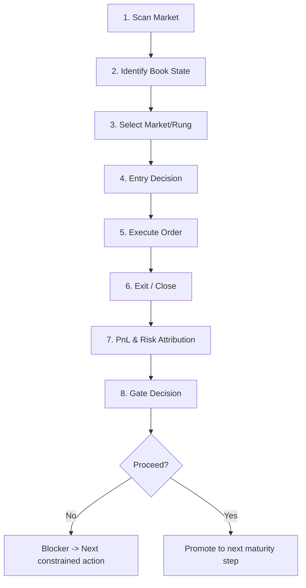

---
title: feat: BTC Closed-Loop Readiness Program
type: feat
status: active
date: 2026-04-02
origin: user-request-btc-closed-loop-2026-04-02
---

# feat: BTC Closed-Loop Readiness Program

## Overview

This plan shifts BTC work from repeated parameter tuning to full-path closure.

Primary objective:

- Close the full BTC execution loop end-to-end with machine-checkable acceptance at every stage.

This plan focuses on BTC only and remains in replay/paper maturity.

## Problem Frame

Recent BTC runs repeatedly fail the same acceptance blockers:

- `route_conversion_quality` fails (`route_adverse_fill_too_high`)
- `close_out_quality` fails (`close_out_stop_out_pressure`, `close_out_negative_realized_pnl_bps`)
- `profitability_tail_risk` fails (`pnl_per_notional_not_positive`, `top3_loss_concentration_above_ceiling`)

Observed pattern: high modeled edge does not convert into stable realized edge.

## Requirements Trace

- R1. Keep scope BTC-only and do not widen to other underlyings.
- R2. Keep hard risk controls authoritative; no risk-guard bypass.
- R3. Make each loop stage explicit and machine-verifiable.
- R4. Improve route conversion and close-out quality before scaling activity.
- R5. Increase closed-trade evidence density to pass promotion gate sample thresholds.
- R6. Reduce loss concentration and keep tail losses within gate ceilings.
- R7. Keep outputs operator-facing with clear "why blocked" and "what next" actions.
- R8. Keep maturity language accurate (`replay`/`paper`, not live-ready).

## Scope Boundaries

In scope:

- BTC market scan -> identify -> select -> decide -> execute -> close -> attribute -> gate loop
- phase2 strategy, runtime context, execution management, scorecard packaging
- replay/paper evidence loop and deterministic comparison

Out of scope:

- non-BTC market expansion
- live trading enablement
- wallet/real-fund routing
- broad architecture rewrite

## Closed-Loop Flow (Acceptance by Stage)

Stage acceptance contract:

- Scan Market: BTC target universe only, blocked/watch-only families enforced.
- Identify Book State: required market/state fields complete and reproducible.
- Select Market/Rung: selected candidates have explicit inclusion reason and non-selected have explicit reject reason.
- Entry Decision: each entry has route rationale + edge/risk evidence in diagnostics.
- Execute Order: conversion quality no longer dominated by repeated expiry loops.
- Exit/Close: closed trades accumulate beyond minimum sample gate and stop-out dominance drops.
- Attribution: `pnl_per_notional` and loss concentration are measurable by family/signature/market.
- Gate Decision: scorecard emits deterministic pass/review with one dominant blocker and next constrained action.

## Key Technical Decisions

- Decision 1: Prioritize loop closure over aggressive alpha expansion.
  - Rationale: repeated blockers indicate execution closure gap, not just alpha insufficiency.

- Decision 2: Keep family-specific controls independent (`reach` vs `dip`).
  - Rationale: failure modes differ and need separate guardrails.

- Decision 3: Use stage-gate-first experiment ranking.
  - Rationale: aggregate PnL alone hides where closure fails.

- Decision 4: Freeze evidence protocol for comparability.
  - Rationale: avoid mixed-window false conclusions.

## Execution Checklist (Ordered)

- [x] Step 0: Lock BTC Closure Protocol and Baseline Windows
- [x] Step 1: Harden Scan/Identify Contract and Diagnostics
- [x] Step 2: Tighten Selection/Decision Transparency
- [ ] Step 3: Stabilize Execution Conversion (Expiry Loop Suppression)
- [ ] Step 4: Improve Exit/Close Quality and Sample Density
- [ ] Step 5: Add Attribution-Level Tail-Loss Controls
- [ ] Step 6: Gate Packaging and Deterministic Closure Verdict
- [ ] Step 7: Replay/Paper Verification Bundle and Go/No-Go

## Implementation Units

- [x] **Unit 0: BTC Closure Protocol Lock**

Goal:

- Make every BTC run comparable and closure-auditable.

Requirements:

- R1, R3, R8

Dependencies:

- None

Files:

- Modify: `docs/CRYPTO_MATURITY_PROBLEM_CHECKLIST.md`
- Modify: `src/pm_bot/research/autoresearch.py`
- Modify: `src/pm_bot/cli.py`
- Test: `tests/unit/research/test_autoresearch.py`
- Test: `tests/integration/test_cli_research.py`

Approach:

- Enforce mandatory protocol metadata for closure runs (`window_set_id`, `variant_id`, `evidence_tier`, `loop_stage_set`).
- Reject ranking/comparison when protocol fields mismatch.
- Emit protocol summary in operator-facing reports.

Test scenarios:

- Happy path: comparable runs rank successfully.
- Edge case: missing `loop_stage_set` gives explicit blocker.
- Error path: mixed-window comparisons are rejected deterministically.

Acceptance:

- Any closure candidate without protocol parity is marked invalid for promotion decision.

- [x] **Unit 1: Scan/Identify Contract Hardening**

Goal:

- Ensure candidate universe and book-state inputs are consistent and traceable.

Requirements:

- R1, R3, R7

Dependencies:

- Unit 0

Files:

- Modify: `src/pm_bot/strategies/crypto/phase2/runtime_context.py`
- Modify: `src/pm_bot/strategies/crypto/phase2/replay.py`
- Modify: `src/pm_bot/strategies/crypto/phase1/selection.py`
- Test: `tests/unit/strategies/test_crypto_phase2_runtime_context.py`
- Test: `tests/unit/strategies/test_crypto_phase2_replay.py`
- Test: `tests/unit/strategies/test_crypto_phase1_selection.py`

Approach:

- Enforce BTC-only scan constraints for closure profiles.
- Promote watch-only and blocked-market enforcement as first-class runtime contract.
- Add diagnostics for scan eligibility and identify-stage field completeness.

Test scenarios:

- Happy path: eligible BTC markets pass with complete identify fields.
- Edge case: watch-only family is blocked before decision stage.
- Error path: missing identify fields result in explicit reject reason.

Acceptance:

- Stage statuses show `scan_quality=pass` and `selection_pass_through=pass` for valid closure windows.

- [x] **Unit 2: Selection/Decision Transparency Upgrade**

Goal:

- Make entry decisions explainable and auditable by market/family/route.

Requirements:

- R3, R4, R7

Dependencies:

- Unit 1

Files:

- Modify: `src/pm_bot/strategies/crypto/phase2/strategy.py`
- Modify: `src/pm_bot/strategies/crypto/phase2/execution.py`
- Modify: `src/pm_bot/strategies/crypto/phase2/config_registry.py`
- Test: `tests/unit/strategies/test_crypto_phase2_strategy.py`
- Test: `tests/unit/strategies/test_crypto_phase2_execution.py`

Approach:

- Add mandatory decision diagnostics: selected-route reason, skipped-route reason, net-edge-after-premium reason code.
- Keep strict guardrail ordering (risk -> eligibility -> route policy -> entry).
- Emit reason taxonomy stable enough for scorecard aggregation.

Test scenarios:

- Happy path: accepted candidate has full decision trace.
- Edge case: candidate rejected due to one specific guard emits stable reason code.
- Error path: missing route signal falls back to safe reject and logs reason.

Acceptance:

- Every emitted entry signal has a deterministic decision trace payload.

- [ ] **Unit 3: Conversion Stabilization (Expiry Loop Suppression)**

Goal:

- Break repeated maker-expiry loop and improve route conversion quality.

Requirements:

- R2, R4

Dependencies:

- Unit 2

Files:

- Modify: `src/pm_bot/strategies/crypto/phase2/execution.py`
- Modify: `src/pm_bot/strategies/crypto/phase2/strategy.py`
- Modify: `src/pm_bot/strategies/crypto/phase2/management.py`
- Modify: `src/pm_bot/strategies/crypto/phase2/config_registry.py`
- Test: `tests/unit/strategies/test_crypto_phase2_execution.py`
- Test: `tests/unit/strategies/test_crypto_phase2_management.py`
- Test: `tests/unit/strategies/test_crypto_phase2_strategy.py`

Approach:

- Strengthen family-local expiry counters and cooldown escalation.
- Ensure bounded fallback route behavior without global taker unlock.
- Add per-signature conversion diagnostics for blocker targeting.

Test scenarios:

- Happy path: repeated no-fill/expiry triggers bounded fallback and cooldown.
- Edge case: healthy maker market does not over-escalate.
- Error path: stale execution counters fail safe (reduce activity, no crash).

Acceptance:

- `route_conversion_quality` no longer fails on repeated expiry dominance in target windows.

- [ ] **Unit 4: Close-Out Quality and Sample Density**

Goal:

- Increase quality closed trades and reduce stop-out/negative-close pressure.

Requirements:

- R4, R5

Dependencies:

- Unit 3

Files:

- Modify: `src/pm_bot/strategies/crypto/phase2/management.py`
- Modify: `src/pm_bot/strategies/crypto/phase2/strategy.py`
- Modify: `src/pm_bot/strategies/crypto/phase2/final_report.py`
- Test: `tests/unit/strategies/test_crypto_phase2_management.py`
- Test: `tests/unit/strategies/test_crypto_phase2_strategy.py`
- Test: `tests/unit/strategies/test_crypto_phase2_final_report.py`

Approach:

- Tighten exit behavior for fragile signatures while preserving safe winners.
- Add close-quality-aware throttles to avoid repeating poor close patterns.
- Surface closure-quality reasons directly in scorecard stage blockers.

Test scenarios:

- Happy path: closed trade count increases and stop-out pressure decreases.
- Edge case: benign signatures keep baseline close behavior.
- Error path: low-sample windows keep conservative close policy.

Acceptance:

- `close_out_quality` passes or degrades to a single clearly bounded blocker.

- [ ] **Unit 5: Attribution and Tail-Loss Control Layer**

Goal:

- Control loss concentration while preserving measurable edge capture.

Requirements:

- R2, R6

Dependencies:

- Unit 4

Files:

- Modify: `src/pm_bot/strategies/crypto/phase2/final_report.py`
- Modify: `src/pm_bot/strategies/crypto/phase2/suite.py`
- Modify: `src/pm_bot/research/autoresearch.py`
- Test: `tests/unit/strategies/test_crypto_phase2_final_report.py`
- Test: `tests/unit/strategies/test_crypto_phase2_suite.py`
- Test: `tests/unit/research/test_autoresearch.py`

Approach:

- Add family/signature-level concentration diagnostics (`top1`, `top3`, market/signature bucket).
- Bind concentration breaches to explicit gate blockers and constrained actions.
- Keep single-loss and top3 concentration checks machine-readable and stable.

Test scenarios:

- Happy path: concentration below ceiling clears tail-loss blocker.
- Edge case: only one bucket breaches and blocker is correctly scoped.
- Error path: missing attribution data triggers conservative blocker.

Acceptance:

- `profitability_tail_risk` is evaluable with explicit concentration and pnl-per-notional evidence.

- [ ] **Unit 6: Gate Packaging and Deterministic Verdict**

Goal:

- Produce a single operator artifact that answers pass/fail and next action.

Requirements:

- R3, R7, R8

Dependencies:

- Unit 5

Files:

- Modify: `src/pm_bot/strategies/crypto/phase2/final_report.py`
- Modify: `src/pm_bot/strategies/crypto/phase2/suite.py`
- Modify: `src/pm_bot/cli.py`
- Test: `tests/unit/strategies/test_crypto_phase2_final_report.py`
- Test: `tests/unit/strategies/test_crypto_phase2_suite.py`
- Test: `tests/integration/test_cli_research.py`

Approach:

- Guarantee deterministic `recommended_action`, `route_stage_acceptance_decision`, `dominant_route_stage_blocker`, `next_constrained_action`.
- Add operator summary block that explains not-ready reason in one screen.
- Keep maturity wording constrained to replay/paper/shadow stages.

Test scenarios:

- Happy path: all stage gates pass -> `proceed`.
- Edge case: one stage fails -> one dominant blocker and constrained action.
- Error path: partial scorecard -> deterministic fallback with conservative `review`.

Acceptance:

- Operator can determine go/no-go without manual interpretation.

- [ ] **Unit 7: Verification Bundle and Promotion Readiness Review**

Goal:

- Validate closure across fixed windows and produce final go/no-go evidence set.

Requirements:

- R5, R6, R8

Dependencies:

- Unit 6

Files:

- Modify: `docs/CRYPTO_MATURITY_PROBLEM_CHECKLIST.md`
- Modify: `docs/plans/2026-04-02-002-feat-btc-closed-loop-readiness-plan.md`
- Generate artifacts under: `data/research/crypto-phase2-suite-btc-closure-*`
- Test: `tests/integration/test_cli_research.py`

Approach:

- Run fixed-window closure bundle (train/validation/holdout) with protocol lock.
- Compare candidates only when comparable; reject mixed evidence.
- Record final blocker-to-action mapping in checklist.

Test scenarios:

- Happy path: all windows satisfy gate thresholds -> closure pass-ready.
- Edge case: one window fails but failure is isolated and actionable.
- Error path: evidence mismatch invalidates conclusion.

Acceptance:

- Closure package includes deterministic verdict + full blocker evidence + next constrained action.

## Verification Strategy

For each unit:

- Run targeted unit tests for modified modules.
- For scorecard and CLI fields, run integration checks.
- After Unit 7, run closure suite on fixed BTC windows and compare against baseline.

Global verification gate:

- No claim of readiness unless outputs show stage-level pass evidence.
- If any core stage remains `review`, output must include one dominant blocker and bounded next action.

## Risk Register

- Risk: overfitting to one BTC window.
  - Mitigation: fixed train/validation/holdout protocol and comparability guard.

- Risk: conversion improvement degrades close quality.
  - Mitigation: stage-coupled acceptance (`route_conversion_quality` + `close_out_quality`) in same run.

- Risk: sample inflation with low-quality closes.
  - Mitigation: quality-aware close thresholds, not count-only optimization.

- Risk: concentration drops by reducing activity too much.
  - Mitigation: include notional-efficiency and evidence-density checks together.

## Deliverables

- Updated BTC closure-capable strategy/reporting code paths.
- Stable operator-facing stage-gate artifact bundle (`suite.json/.md`, `final_scorecard.json/.md`).
- Updated maturity checklist reflecting current stage and remaining blockers.
- Deterministic comparability-aware autoresearch comparison output.

## Definition of Done

This plan is complete when all are true:

- BTC loop stages are machine-checkable end-to-end.
- Stage blockers are deterministic and actionable.
- Verification bundle proves whether closure is pass-ready or explicitly blocked.
- Maturity statement remains accurate (replay/paper/shadow only until gate truly passes).

## Execution Status (2026-04-02)

- Unit 0 delivered:
  - `autoresearch` protocol metadata now includes `loop_stage_set`.
  - report comparability now blocks missing/mixed `loop_stage_set` in candidate ranking.
  - CLI now supports `--loop-stage-set` and propagates protocol fields in `autoresearch-report` and `autoresearch-compare`.
  - targeted tests passed:
    - `tests/unit/research/test_autoresearch.py` (`9 passed`)
    - `tests/integration/test_cli_research.py -k autoresearch` (`1 passed`)
- Unit 1 delivered:
  - added runtime scan/identify diagnostics contract via `runtime_scan_identify_diagnostics(...)`.
  - wired diagnostics into both paper runtime context and replay context as `scan_identify_diagnostics`.
  - covered with targeted tests:
    - `tests/unit/strategies/test_crypto_phase1_selection.py` (`16 passed`)
    - `tests/unit/strategies/test_crypto_phase2_runtime_context.py` (`6 passed`)
    - `tests/unit/strategies/test_crypto_phase2_replay.py` (`7 passed`)
- Unit 2 delivered:
  - added stable entry decision-trace fields in phase2 signal diagnostics:
    - `decision_trace_version`
    - `entry_decision_reason_code`
    - `entry_decision_rationale_tags`
    - `entry_eligibility_reason`
    - `entry_route_policy_bias`
  - wired `decision_trace_version` into resolved config contract (`strategy` + `config_registry`).
  - covered with targeted tests:
    - `tests/unit/strategies/test_crypto_phase2_strategy.py` (`81 passed`)
    - `tests/unit/strategies/test_crypto_phase2_execution.py` (`22 passed`)
